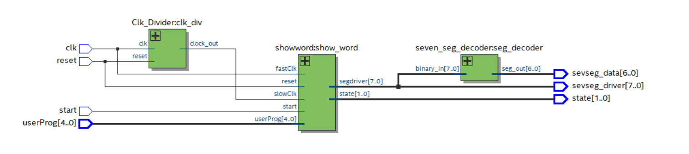

---

# 🧺 Washing Machine Controller – VHDL FSM Project

## 📌 Project Overview

This project implements a **Finite State Machine (FSM) based Washing Machine Controller** using **VHDL**.

The system simulates a programmable washing machine that controls washing, rinsing, and spinning cycles. It was developed and tested using **Intel Quartus Prime** and hardware simulation tools.

The design follows modular digital system principles and demonstrates synchronous FSM-based control logic.

---

## 🎯 Project Objectives

* Design and implement a Finite State Machine (FSM) in VHDL
* Model washing machine operational cycles
* Implement modular hardware components
* Display system states using a seven-segment display
* Apply synchronous digital system design principles

---

## 🏗️ System Architecture

The project consists of multiple VHDL modules:

### 1️⃣ WashingMachineController.vhd

Main FSM controller:

* Controls washing cycle states
* Handles user program selection
* Manages state transitions

---

### 2️⃣ Clk_Divider.vhd

Clock divider module:

* Reduces system clock frequency
* Generates slower clock signals for timing control

---

### 3️⃣ seven_seg_decoder.vhd

Seven-segment decoder:

* Converts binary input into segment control signals
* Displays numbers and characters

---

### 4️⃣ seven_seg_decoder_tb.vhd

Testbench module:

* Verifies seven-segment decoder functionality
* Used for simulation and validation

---

### 5️⃣ showword.vhd

Display control module:

* Drives seven-segment display outputs
* Manages displayed values based on FSM state

---

## ⚙️ Inputs & Outputs

### Inputs

* `clk` – System clock
* `reset` – System reset
* `start` – Start washing cycle
* `userProg` – 5-bit program selection input

### Outputs

* `sevseg_data` – Seven-segment display data
* `sevseg_driver` – Display enable lines
* `state` – Current FSM state

---

## 🔄 FSM Operation

The controller transitions between states such as:

1. Idle
2. Washing
3. Rinsing
4. Spinning

State transitions depend on:

* Start signal
* Reset signal
* Program selection
* Cycle timing completion

The FSM ensures proper sequential execution of washing machine stages.

---

## 🛠️ Tools Used

* VHDL
* Intel Quartus Prime
* ModelSim / NativeLink Simulation
* Digital Logic Design Concepts

---

## 📂 Project Structure

```
FinalProject/
│
├── Clk_Divider.vhd
├── seven_seg_decoder.vhd
├── seven_seg_decoder_tb.vhd
├── showword.vhd
├── WashingMachineController.vhd
├── VHDL_FINALPROJECT.qpf
├── VHDL_FINALPROJECT.qsf
├── simulation/
└── README.md
```

---

## ▶️ How to Run

1. Open Intel Quartus Prime
2. Open `VHDL_FINALPROJECT.qpf`
3. Compile the project
4. Run simulation using ModelSim or NativeLink
5. Observe FSM transitions and seven-segment output

---

## 📚 Academic Context

This project was developed as part of a **Digital Systems / VHDL Design course**.

It demonstrates:

* FSM modeling
* Modular VHDL design
* Synchronous digital logic
* Hardware abstraction
* Simulation and verification techniques

---

## 👨‍💻 Author

**Eng. Samer Alaa Abu Zaina**
Embedded Systems & Digital Design

---

